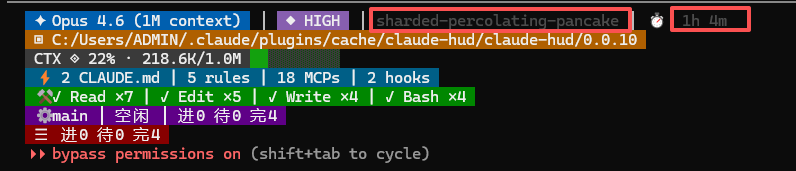

# Claude HUD Vivid

A visually enhanced fork of [claude-hud](https://github.com/jarrodwatts/claude-hud) — real-time statusline HUD for Claude Code with **vivid color-coded backgrounds**, **main/sub-agent tracking**, and **Chinese task summaries**.



## What's Different from the Original

This project is built on top of the excellent [claude-hud](https://github.com/jarrodwatts/claude-hud) by [Jarrod Watts](https://github.com/jarrodwatts). All credit for the core architecture, transcript parsing, and plugin system goes to the original author.

### Enhancements

| Feature | Original claude-hud | This Fork |
|---------|-------------------|-----------|
| **Visual style** | Plain text with minimal colors | Every line has a unique colored background segment |
| **Main Agent status** | Not shown | Always visible (idle / running tool / coordinating) |
| **Sub-Agent display** | Only when active | Placeholder shown even when idle |
| **Task summaries** | English only | Chinese style: `进2 待3 完1` |
| **Effort level** | Not shown | Reads from `settings.json`, displayed as segment |
| **Working directory** | Inline with model info | Dedicated line, always shows full path |
| **Token count** | Percentage only | Compact K/M format alongside percentage |
| **Context bar** | Background breaks on color codes | Continuous background through progress bar |
| **Tool activity** | Hidden when no activity | Placeholder shown when waiting |
| **Session name / Duration** | Plain dim text | Colored background segments |

### Color Scheme (8 unique backgrounds)

```
 ✦ Opus 4.6 (1M context) │ ◆ HIGH │ ◎ session │ ⏱ 5m      ← Cobalt / Purple / Slate / Olive
 ▣ C:/Users/ADMIN/Projects/my-app                           ← Amber
 CTX ◈ 45% · 90.4K/200.0K [█████░░░░░]                      ← Graphite
 ⚡ 2 CLAUDE.md | 5 rules | 18 MCPs | 2 hooks                ← Indigo
 ⚒ ✓ Read ×7 | ✓ Edit ×5 | ✓ Bash ×4                        ← Emerald
 ⚙ main │ 空闲 │ 进0 待0 完4                                  ← Violet
 ◇ 无子Agent活动                                              ← Violet
 ☰ 进0 待0 完4                                                ← Burgundy
```

## Install

### Prerequisites

- Claude Code v1.0.80+
- Node.js 18+

### Step 1: Clone this repo

```bash
git clone https://github.com/yfilwzy/claude-hud-vivid.git ~/.claude/plugins/cache/claude-hud/claude-hud/0.0.10
```

If the directory already exists (e.g., from a previous claude-hud install), back it up first:

```bash
mv ~/.claude/plugins/cache/claude-hud/claude-hud/0.0.10 ~/.claude/plugins/cache/claude-hud/claude-hud/0.0.10.bak
git clone https://github.com/yfilwzy/claude-hud-vivid.git ~/.claude/plugins/cache/claude-hud/claude-hud/0.0.10
```

### Step 2: Install dependencies and build

```bash
cd ~/.claude/plugins/cache/claude-hud/claude-hud/0.0.10
npm ci
npm run build
```

### Step 3: Copy config

```bash
mkdir -p ~/.claude/plugins/claude-hud
cp config.example.json ~/.claude/plugins/claude-hud/config.json
```

### Step 4: Configure statusline

Add the following to your `~/.claude/settings.json`:

**macOS / Linux / Git Bash on Windows:**

```json
{
  "statusLine": {
    "type": "command",
    "command": "bash -c 'dir=$(ls -d \"$HOME/.claude/plugins/cache/claude-hud/claude-hud\"/*/ 2>/dev/null | sort -V | tail -1); exec node \"${dir}dist/index.js\"'",
    "padding": 0
  }
}
```

**Windows PowerShell:**

```json
{
  "statusLine": {
    "type": "command",
    "command": "powershell -Command \"& {$p=(Get-ChildItem $env:USERPROFILE\.claude\plugins\cache\claude-hud\claude-hud -Directory | Sort-Object { [version]$_.Name } -Descending | Select-Object -First 1).FullName; & node (Join-Path $p 'dist\index.js')}\"",
    "padding": 0
  }
}
```

### Step 5: Restart Claude Code

Quit and re-run `claude` in your terminal. The HUD appears immediately.

## Configuration

Edit `~/.claude/plugins/claude-hud/config.json` to customize. See `config.example.json` for all options.

### Key Options

| Option | Type | Default | Description |
|--------|------|---------|-------------|
| `style.useVividSegments` | boolean | `true` | Enable vivid colored backgrounds |
| `display.showMainAgent` | boolean | `true` | Always show main agent status |
| `display.showEffortLevel` | boolean | `true` | Show effort level segment |
| `display.todoStyle` | `"chinese"` \| `"english"` | `"chinese"` | Task summary format |
| `display.agentMaxDisplay` | number | `5` | Max sub-agents to display |
| `display.showTokenCount` | boolean | `true` | Show K/M token count |
| `display.showTools` | boolean | `true` | Show tools activity line |
| `display.showAgents` | boolean | `true` | Show agents line |
| `display.showTodos` | boolean | `true` | Show todos line |
| `display.showDuration` | boolean | `true` | Show session duration |
| `display.showSpeed` | boolean | `true` | Show output token speed |
| `display.showSessionName` | boolean | `true` | Show session slug |
| `display.showConfigCounts` | boolean | `true` | Show CLAUDE.md/rules/MCPs/hooks counts |

### Disabling Vivid Mode

Set `style.useVividSegments` to `false` to fall back to the original claude-hud plain style:

```json
{
  "style": {
    "useVividSegments": false
  }
}
```

## Architecture

```
Claude Code → stdin JSON → parse → render lines → stdout → terminal
           ↘ transcript JSONL → tools/agents/todos/main-agent-status
           ↘ settings.json → effort level
```

Built on the same data flow as the original claude-hud. Key additions:

- `src/effort-level.ts` — Reads `effortLevel` from settings with caching
- `src/render/colors.ts` — `segment()` function for vivid background rendering
- `src/transcript.ts` — Main agent state inference + agent-task binding
- `src/types.ts` — `MainAgentStatus`, `MainAgentState` types

## Credits

- **Original project**: [claude-hud](https://github.com/jarrodwatts/claude-hud) by [Jarrod Watts](https://github.com/jarrodwatts) — MIT License
- **This fork**: Enhanced with vivid visuals, agent tracking, and Chinese localization

## License

MIT — see [LICENSE](LICENSE)

Original work by Jarrod Watts is preserved in [LICENSE-ORIGINAL](LICENSE-ORIGINAL).
